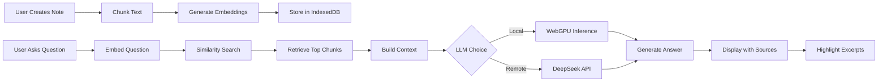

<div align="center">

# 🚀 CrossNotes

### Intelligent Note-Taking with AI-Powered Knowledge Retrieval

[](https://www.typescriptlang.org/)
[](https://reactjs.org/)
[](https://vitejs.dev/)
[](https://firebase.google.com/)
[](LICENSE)

[Features](#-key-features) • [Demo](#-demo) • [Quick Start](#-quick-start) • [Architecture](#-architecture) • [Documentation](#-documentation)

</div>

---

## 🎯 Overview

**CrossNotes** is a next-generation note-taking application that transforms passive notes into an **active, queryable knowledge base**. Built with cutting-edge browser-based AI technology, it enables users to interact with their notes through natural language queries while maintaining complete privacy and zero cloud AI costs.

### Why CrossNotes?

Traditional note-taking apps treat your content as static documents. CrossNotes leverages **Retrieval-Augmented Generation (RAG)** to make your notes **intelligent and interactive**:

- 🧠 **Ask questions** about your notes in natural language
- 🎯 **Get precise answers** grounded in your actual content
- 🔗 **Clickable source citations** with automatic excerpt highlighting
- 🔒 **Privacy-first**: AI processing runs entirely in your browser (optional)
- 💰 **Zero API costs** for embeddings and optional local inference

---

## ✨ Key Features

### 🎨 **Modern Note-Taking Experience**
- **Rich Markdown Editor** with live preview
- **Organized Folders** for structured note management
- **Real-time Sync** across all your devices via Firebase
- **Mobile-First Design** with responsive layouts
- **Dark/Light Theme** support
- **AI-Powered Formatting** for instant note beautification

### 🧠 **Intelligent Knowledge Base (RAG)**
CrossNotes implements a production-grade RAG pipeline entirely in the browser:

- **📊 Semantic Search**: Find notes by meaning, not just keywords
- **💬 Conversational AI**: Ask questions like "What did I write about machine learning?"
- **📚 Source Attribution**: Every answer includes clickable sources
- **✨ Excerpt Highlighting**: Navigate directly to relevant content in source notes
- **🔄 Auto-Indexing**: Notes are automatically indexed for instant retrieval
- **📱 Mobile-Optimized**: Adaptive parameters for smooth mobile performance

### 🔐 **Privacy-First Architecture**
- **Local Embeddings**: Text embeddings generated entirely in-browser using Transformers.js
- **Local Vector Store**: IndexedDB keeps all vector data on your device
- **Optional Local LLM**: Run AI models via WebGPU for complete offline operation
- **Cloud Fallback**: Optionally use DeepSeek API ($0.14 per 1M tokens) when needed

### 📄 **Document Management**
- **Multi-Format Upload**: Import TXT, Markdown, and PDF documents
- **Batch Processing**: Upload multiple files simultaneously
- **Smart Extraction**: Automatic text extraction with content preservation
- **Export Options**: Download notes in various formats

---

## 🎥 Demo

> **Try It Live**: Experience the power of AI-driven note retrieval in action

### Typical Workflow
1. **Create & Organize** notes in folders
2. **Index Your Knowledge** with one click
3. **Ask Questions** like:
   - "Summarize my notes about project planning"
   - "Which note mentions authentication?"
   - "What were my thoughts on React optimization?"
4. **Get Instant Answers** with source citations
5. **Navigate Seamlessly** from answers to highlighted excerpts

---

## 🚀 Quick Start

### Prerequisites
- **Node.js** 18+ (or Bun)
- **npm** / **pnpm** / **yarn** / **bun**
- **Firebase Project** (for authentication and sync)
- **OpenRouter API Key** (optional, for remote AI inference)

### Installation

```bash
# Clone the repository
git clone https://github.com/nareshAiNexus/crossnotes.git
cd crossnotes

# Install dependencies
npm install

# Configure environment
cp .env.example .env
# Edit .env with your Firebase credentials
```

### Environment Configuration

Create a `.env` file with the following variables:

```env
# Firebase Configuration (Required)
VITE_FIREBASE_API_KEY=your_firebase_api_key
VITE_FIREBASE_AUTH_DOMAIN=your_project.firebaseapp.com
VITE_FIREBASE_DATABASE_URL=https://your_project.firebaseio.com
VITE_FIREBASE_PROJECT_ID=your_project_id
VITE_FIREBASE_STORAGE_BUCKET=your_project.appspot.com
VITE_FIREBASE_MESSAGING_SENDER_ID=your_sender_id
VITE_FIREBASE_APP_ID=your_app_id

# OpenRouter API (Optional - for remote AI inference)
VITE_OPENROUTER_DEEPSEEK_API_KEY=your_openrouter_key
# Fallback supported: VITE_DEEPSEEK_API_KEY
```

### Run Development Server

```bash
npm run dev
```

Visit `http://localhost:5173` and start taking intelligent notes!

### Build for Production

```bash
npm run build
npm run preview
```

---

## 🏗️ Architecture

### Technology Stack

#### **Frontend Framework**
- **React 18** with TypeScript for type safety
- **Vite** for lightning-fast development and optimized builds
- **React Router** for seamless navigation
- **TanStack Query** for efficient data fetching and caching

#### **UI/UX**
- **Shadcn/ui** components (Radix UI primitives)
- **Tailwind CSS** for utility-first styling
- **Lucide Icons** for consistent iconography
- **MDX Editor** for rich markdown editing
- **Responsive Design** with mobile-first approach

#### **Backend & Storage**
- **Firebase Authentication** (Email/Password, Google OAuth)
- **Firebase Realtime Database** for note synchronization
- **Firebase Storage** for file uploads
- **Security Rules** for data protection

#### **AI/ML Pipeline**
- **Transformers.js** (`@xenova/transformers`)
  - Model: `all-MiniLM-L6-v2` (384-dimensional embeddings)
  - Runs entirely in-browser using ONNX Runtime
  - ~23MB model size, cached after first load
- **MLC WebLLM** (Optional)
  - Local LLM inference via WebGPU
  - Models: Llama-3.2-1B, Phi-3.5-mini, etc.
  - Complete privacy, zero API costs
- **OpenRouter / DeepSeek** (Fallback)
  - Cloud inference when local LLM unavailable
  - Extremely cost-effective ($0.14 per 1M tokens)

#### **Vector Database**
- **IndexedDB** (via `idb` library)
  - Client-side vector storage
  - Efficient cosine similarity search
  - Supports large-scale note collections (1000+ notes)

### RAG Pipeline Flow



### Key Architectural Decisions

#### **Why Browser-Based AI?**
- ✅ **Privacy**: Your notes never leave your device for AI processing
- ✅ **Cost**: Zero embedding costs (typically $0.0001 per 1K tokens with cloud APIs)
- ✅ **Speed**: No network latency for embeddings
- ✅ **Offline**: Works without internet connection

#### **Why Firebase?**
- ✅ **Rapid Development**: Authentication, database, and storage in one SDK
- ✅ **Real-Time Sync**: Instant updates across devices
- ✅ **Scalability**: Google's infrastructure handles traffic automatically
- ✅ **Security**: Built-in security rules, no SQL injection risks
- ✅ **Cost-Effective**: Generous free tier (50K reads/day)

#### **Why Dual LLM Strategy?**
- ✅ **Privacy Options**: Users choose their comfort level
- ✅ **Device Support**: WebGPU only available on ~40% of devices
- ✅ **Performance**: Local inference on desktop, remote on mobile
- ✅ **Reliability**: Fallback ensures service continuity

---

## 📚 Documentation

### Usage Guide

#### **Creating and Organizing Notes**
1. **Sign up** using email or Google authentication
2. **Create folders** to organize notes by topic
3. **Write notes** using the markdown editor
4. **Preview** your formatted notes in real-time
5. **Auto-save** ensures you never lose work

#### **Knowledge Base Chat**
1. Open the **Knowledge Base** floating button
2. Click **"Index Notes"** to create your knowledge base
3. Wait for indexing to complete (progress bar shows status)
4. Ask natural language questions about your notes
5. Click on **Sources** to view the original notes
6. **Highlighted excerpts** show exactly where the answer came from

#### **Document Import**
1. Click the **Upload** button in the sidebar
2. Select TXT, MD, or PDF files
3. Files are automatically processed and indexed
4. Access imported content immediately

#### **Settings & Preferences**
- Toggle between **light/dark themes**
- Choose **local or remote AI inference**
- Configure **API keys** for optional features
- Manage **folders and note organization**

### Advanced Features

#### **Mobile Optimization**
CrossNotes automatically adapts to mobile devices:
- **Smaller chunk sizes** (2200 vs 3000 chars) for faster processing
- **Throttled progress updates** to prevent UI freezing
- **Reduced retrieval parameters** (8 vs 12 top chunks)
- **Disabled local LLM** for battery efficiency
- **Responsive layouts** for touch interfaces

#### **Performance Characteristics**
- **Embedding Generation**: ~50ms per chunk on modern CPUs
- **Query Latency**: <500ms for retrieval
- **Indexing Speed**: ~100 notes per minute
- **Vector Search**: O(n) with optimized similarity calculation
- **UI Responsiveness**: 60fps maintained during operations

#### **Security & Privacy**
- **Firebase Security Rules**: Users can only access their own data
- **Token-Based Authentication**: Secure session management
- **Local Data Encryption** (planned): End-to-end encryption
- **API Key Protection**: Environment variables, not exposed in bundle
- **Content Security Policy**: Protection against XSS attacks

---

## 🛠️ Development

### Project Structure
```
crossnotes/
├── src/
│   ├── components/          # React components
│   │   ├── Editor.tsx       # Markdown editor
│   │   ├── Sidebar.tsx      # Navigation & note list
│   │   ├── KnowledgeBaseChat.tsx  # RAG interface
│   │   └── ui/              # Shadcn components
│   ├── pages/               # Route pages
│   │   ├── Index.tsx        # Main dashboard
│   │   └── AuthPage.tsx     # Authentication
│   ├── hooks/               # Custom React hooks
│   │   ├── useAuth.tsx      # Authentication logic
│   │   ├── useNotes.tsx     # Note management
│   │   └── useKnowledgeBase.tsx  # RAG operations
│   ├── lib/                 # Core logic & services
│   │   ├── firebase.ts      # Firebase integration
│   │   ├── embeddings.ts    # Transformers.js wrapper
│   │   ├── vectordb.ts      # IndexedDB vector store
│   │   ├── rag.ts           # RAG pipeline
│   │   ├── chunking.ts      # Text chunking
│   │   └── deepseek.ts      # API integration
│   └── App.tsx              # Root component
├── public/                  # Static assets
└── package.json
```

### Available Scripts
```bash
npm run dev          # Start development server
npm run build        # Production build
npm run build:dev    # Development mode build
npm run preview      # Preview production build
npm run lint         # ESLint code quality check
npm run test         # Run Vitest tests
npm run test:watch   # Watch mode for tests
```

### Testing
```bash
# Run all tests
npm test

# Watch mode (for TDD)
npm run test:watch

# Coverage report
npm test -- --coverage
```

### Code Quality
- **ESLint** for code linting
- **TypeScript** for type safety (strict mode)
- **Prettier** for consistent formatting (recommended)
- **Vitest** for unit and integration testing

---

## 🤝 Contributing

Contributions are welcome! CrossNotes is open source and community-driven.

### How to Contribute
1. **Fork** the repository
2. **Create a branch**: `git checkout -b feature/your-feature`
3. **Make changes** and test thoroughly
4. **Run quality checks**: `npm run lint && npm test && npm run build`
5. **Commit**: `git commit -m "Add: your feature description"`
6. **Push**: `git push origin feature/your-feature`
7. **Open a Pull Request** with a clear description

### Areas for Contribution
- 🐛 **Bug fixes** and performance improvements
- 📱 **Mobile UX** enhancements
- 🌐 **Internationalization** (i18n)
- 📖 **Documentation** improvements
- 🎨 **UI/UX** refinements
- 🧪 **Test coverage** expansion
- 🚀 **New features** (discuss in issues first)

### Development Guidelines
- Follow existing code style and patterns
- Write tests for new features
- Update documentation for API changes
- Keep commits atomic and well-described
- Ensure all tests pass before submitting PR

---

## 🗺️ Roadmap

### Short-term (Q2 2026)
- [ ] **Collaborative Notes**: Share notes with other users
- [ ] **Export Options**: Markdown/JSON/PDF export
- [ ] **Advanced Search**: Boolean operators, date filters
- [ ] **Offline Mode**: Full functionality without internet
- [ ] **Browser Extensions**: Chrome/Firefox extensions

### Medium-term (Q3-Q4 2026)
- [ ] **Graph View**: Visualize note connections
- [ ] **Smart Suggestions**: AI-powered related notes
- [ ] **Voice Input**: Transcribe voice notes with Whisper.js
- [ ] **Multi-modal RAG**: Index images with CLIP embeddings
- [ ] **Team Workspaces**: Shared knowledge bases

### Long-term (2027)
- [ ] **Self-Hosting**: Docker container for on-premise deployment
- [ ] **Plugin System**: Community-developed extensions
- [ ] **E2E Encryption**: Zero-knowledge architecture
- [ ] **Desktop Apps**: Electron-based native applications
- [ ] **Advanced Analytics**: Usage patterns and insights

---

## 📊 Comparisons

| Feature | CrossNotes | Notion AI | Obsidian | Evernote |
|---------|-----------|-----------|----------|----------|
| **Local-First AI** | ✅ | ❌ | ⚠️ Complex | ❌ |
| **Browser Embeddings** | ✅ | ❌ | ❌ | ❌ |
| **Source Citations** | ✅ Highlighted | ⚠️ Basic | ⚠️ Plugin | ❌ |
| **Mobile Optimized** | ✅ | ✅ | ⚠️ | ✅ |
| **Privacy (Local LLM)** | ✅ Optional | ❌ | ⚠️ | ❌ |
| **Open Source** | ✅ | ❌ | ✅ | ❌ |
| **Cost** | **Free** | $10/mo | Free | $8/mo |

---

## 🔧 Troubleshooting

### Common Issues

#### **Firebase Connection Errors**
- Verify `.env` credentials are correct
- Check Firebase project settings
- Ensure database rules allow authenticated access

#### **Local LLM Not Available**
- WebGPU requires Chrome/Edge 113+ or compatible GPU
- Enable hardware acceleration in browser settings
- Fallback to DeepSeek API automatically

#### **Slow Indexing**
- Large PDFs can take time to process
- Consider batch uploads for better progress tracking
- Clear IndexedDB cache if stale data exists

#### **Search Returns No Results**
- Ensure notes are indexed (check Knowledge Base status)
- Try rephrasing questions with different keywords
- Verify score threshold settings

### Debug Mode
```bash
# Enable verbose logging
VITE_DEBUG_MODE=true npm run dev
```

---

## 📄 License

This project is licensed under the **MIT License** - see the [LICENSE](LICENSE) file for details.

### Third-Party Licenses
- **Transformers.js**: Apache 2.0
- **React**: MIT
- **Firebase**: Google Terms of Service
- **Shadcn/ui**: MIT

---

## 🙏 Acknowledgments

Built with amazing open-source technologies:
- [React](https://react.dev) - UI library
- [Vite](https://vitejs.dev) - Build tool
- [Transformers.js](https://huggingface.co/docs/transformers.js) - Browser ML
- [MLC WebLLM](https://github.com/mlc-ai/web-llm) - WebGPU inference
- [Firebase](https://firebase.google.com) - Backend services
- [Shadcn/ui](https://ui.shadcn.com) - Component library
- [Tailwind CSS](https://tailwindcss.com) - Styling framework

Special thanks to the open-source community for making privacy-preserving AI accessible to everyone.

---

## 📞 Contact & Support

- **Repository**: [github.com/nareshAiNexus/crossnotes](https://github.com/nareshAiNexus/crossnotes)
- **Author**: [nareshAiNexus](https://github.com/nareshAiNexus)
- **Issues**: [GitHub Issues](https://github.com/nareshAiNexus/crossnotes/issues)
- **Discussions**: [GitHub Discussions](https://github.com/nareshAiNexus/crossnotes/discussions)

---

<div align="center">

**⭐ Star this project if you find it useful!**

Made with ❤️ by [nareshAiNexus](https://github.com/nareshAiNexus)

</div>
